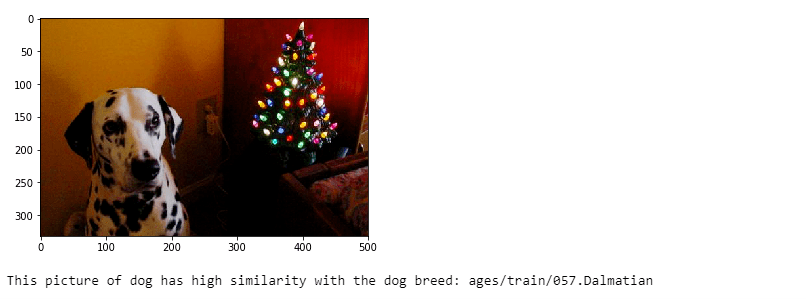

# Dog Breed Classifier
## Project Motivation and Overview
This project uses Convolutional Neural Networks (CNNs) based pipeline to process real-world, user-supplied images that classify dog breeds for the completion of Udacity Data Scientist Nanodegree Capstone Project. 
The project marks the first steps towards developing an algorithm that could be used as part of a mobile or web app. Given an image (from media or Camera) If a dog is detected in the image, it will provide an estimate of the dog’s breed. If a human is detected, as an act of humor, it will provide an estimate of the dog breed that the person is most resembling.

## Table of Contents
1. Requirement
2. File Descriptions
3. Implementation
4. Results


### 1. Requirement
* Python3
* Numpy
* Pandas
* cv2
* TensorFlow
* keras
* matplotlib
* tqdm


### 2. File Descriptions


There are 5 directories. **bottlenect_features** directory should contain model features of pre-trained architectures used in the dog_app. The bottleneck_features will be downloaded and stored when running the download script in dog_app.ipynb

The **dog_app.ipynb** script is the main script determining the breed and class of the given image. it also contains illustrations of the process used. 

The **images folder** should contain the dataset images. It should be divided into subfolders titled train, valid and test respectively

The **saved_models** folder should contain the files for the pre-trained ResNet50, VGG16, and Inception models.

**Requirements** directory contains the docker setup yml script and the **haarcascades** directory contains an implementation of Haar feature-based cascade classifiers to detect human faces in images.


### 3. Implementation

To run the script you need to install the requred libraries and run jupyter notebook 
```
cd <Project Directory>
jupyter notebook
```
### 4. Results
Face detector OpenCV Haar feature-based cascade classifiers
 

Model test of dog images
 

Model test of human images
 

Model Comparision
 

The details of the results are discussed [here](https://medium.com/@dagmsky/dog-breed-classifier-3e9afbbb1864)
### Licensing and Acknowledgements
This project is the Udacity Data Scientist Nanodegree Capstone Project. The Udacity license is included **LICENSE.txt** 